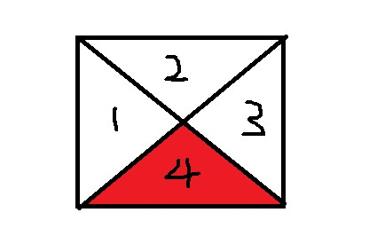

#### 盒模型介绍

CSS3 中的盒模型有以下两种：**标准盒模型**、**IE（替代）盒模型**。

两种盒子模型都是由 `content + padding + border + margin` 构成，其大小都是由 `content + padding + border` 决定的，但是盒子内容宽/高度（即 `width/height`）的计算范围根据盒模型的不同会有所不同：

- 标准盒模型：只包含 `content` 。
- IE（替代）盒模型：`content + padding + border` 。

可以通过 `box-sizing` 来改变元素的盒模型：

- `box-sizing: content-box` ：标准盒模型（默认值）。
- `box-sizing: border-box` ：IE（替代）盒模型。

## CSS选择器有哪些？哪些属性可以继承？

### CSS选择器：

属性选择器、类选择器、标签选择器、id 选择器、

相邻选择器、子选择器、后代选择器、通配符选择器、伪类选择器

**可继承的属性：**

font-size, font-family, color

**不可继承的样式：**

border, padding, margin, width, height

**优先级（就近原则）：**

!important > [ id > class > tag ]  
!important 比内联优先级高

## 优先级计算

元素选择符： 1  
class选择符： 10  
id选择符：100  
元素标签：1000

1. !important声明的样式优先级最高，如果冲突再进行计算。
2. 如果优先级相同，则选择最后出现的样式。
3. 继承得到的样式的优先级最低。

## 如何居中div？

## 利用定位实现垂直水平居中

```css
#test {
        border: 1px solid #000;
        width: 200px;
        height: 200px;
      }

      /* 利用定位实现垂直水平居中 */
      body {
        position: relative;    //父元素
      }

      #test {
        position: absolute;    //子元素
        top: 50%;
        left: 50%;
        margin-left: -100px;    //子元素witdh的一半
        margin-top: 100px;    //子元素higth的一半
      }
```

### 垂直居中

1. `margin: 0 auto;`

2. 

### 水平居中

## 如何居中一个浮动元素？

## display有哪些值

## position 的值

 static（默认）：按照正常文档流进行排列；  
relative（相对定位）：不脱离文档流
absolute(绝对定位)
fixed(固定定位)：所固定的参照对像是可视窗口。

## 伪类和伪属性区别

## CSS3

1. RGBA和透明度
2. background-image background-origin(content-box/padding-box/border-box) background-size background-repeat
3. word-wrap（对长的不可分割单词换行）word-wrap：break-word
4. 文字阴影：text-shadow： 5px 5px 5px #FF0000;（水平阴影，垂直阴影，模糊距离，阴影颜色）
5. font-face属性：定义自己的字体
6. 圆角（边框半径）：border-radius 属性用于创建圆角
7. 边框图片：border-image: url(border.png) 30 30 round
8. 盒阴影：box-shadow: 10px 10px 5px #888888
9. 媒体查询：定义两套css，当浏览器的尺寸变化时会采用不同的属性

### CSS3新增的伪类

p:first-of-type 选择属于其父元素的首个元素  
p:last-of-type 选择属于其父元素的最后元素  
p:only-of-type 选择属于其父元素唯一的元素  
p:only-child 选择属于其父元素的唯一子元素  
p:nth-child(2) 选择属于其父元素的第二个子元素  
:enabled :disabled 表单控件的禁用状态。  
:checked 单选框或复选框被选中。

## flex相关知识

### [主轴](https://developer.mozilla.org/zh-CN/docs/Web/CSS/CSS_Flexible_Box_Layout/Basic_Concepts_of_Flexbox#%E4%B8%BB%E8%BD%B4 "Permalink to 主轴")

主轴由 `flex-direction` 定义，可以取4个值：

- `row`
- `row-reverse`
- `column`
- `column-reverse`

### [交叉轴](https://developer.mozilla.org/zh-CN/docs/Web/CSS/CSS_Flexible_Box_Layout/Basic_Concepts_of_Flexbox#%E4%BA%A4%E5%8F%89%E8%BD%B4 "Permalink to 交叉轴")

交叉轴垂直于主轴，所以如果你的`flex-direction` (主轴) 设成了 `row` 或者 `row-reverse` 的话，交叉轴的方向就是沿着列向下的。

## 用纯CSS创建一个三角形的原理是什么？



1、2、3、4 分别为 div 元素的四个 border，当 border 够大时，将会均分原理，将 div 分为四个部分，这个时候将其他三个 border 的颜色设为透明即可看见 四分之一 的border 为一个三角形

```css
        width: 50px;
        height: 50px;
        border-top: 40px solid transparent;
        border-left: 40px solid transparent;
        border-right: 40px solid transparent;
        border-bottom: 40px solid #ff0000;
```

## 品字布局

第一种真正的品字：

1. 三块高宽是确定的；
2. 上面那块用margin: 0 auto;居中；
3. 下面两块用float或者inline-block不换行；
4. 用margin调整位置使他们居中。

第二种全屏的品字布局:  
上面的div设置成100%，下面的div分别宽50%，然后使用float或者inline使其不换行。

## 为什么要初始化CSS样式

因为浏览器的兼容问题，不同浏览器对有些标签的默认值是不同的，如果没对CSS初始化往往会出现浏览器之间的页面显示差异。

## **CSS里的visibility属性有个collapse属性值？在不同浏览器下以后什么区别？**

当一个元素的visibility属性被设置成collapse值后，对于一般的元素，它的表现跟hidden是一样的。

1. chrome中，使用collapse值和使用hidden没有区别。
2. firefox，opera和IE，使用collapse值和使用display：none没有什么区别。

## **display:none与visibility：hidden的区别？**

display：none 不显示对应的元素，在文档布局中**不再分配空间**（回流+重绘）  
visibility：hidden 隐藏对应元素，在文档布局中**仍保留原来的空间**（重绘）

## **对BFC规范(块级格式化上下文：block formatting context)的理解？**

BFC规定了内部的Block Box如何布局。  
定位方案：

1. 内部的Box会在**垂直方向**上一个接一个放置。
2. Box垂直方向的距离由margin决定，属于**同一个BFC**的两个相邻Box的**margin会发生重叠**。
3. 每个元素的margin box 的左边，与包含块border box的左边相接触。
4. **BFC的区域不会与float box重叠**。
5. BFC是页面上的一个隔离的独立容器，容器里面的**子元素不会影响到外面的元素。**
6. **计算BFC的高度时，浮动元素也会参与计算**。

满足下列条件之一就可触发BFC

1. **根元素，即html**
2. **float的值不为none（默认）**
3. **overflow的值不为visible（默认）**
4. **display的值为inline-block、table-cell、table-caption**
5. **position的值为absolute或fixed**

## **为什么会出现浮动和什么时候需要清除浮动？清除浮动的方式？**

### 浮动带来的问题：

1. 父元素的高度无法被撑开，影响与父元素同级的元素
2. 与浮动元素同级的非浮动元素（内联元素）会跟随其后
3. 若非第一个元素浮动，则该元素之前的元素也需要浮动，否则会影响页面显示的结构。

### 清除浮动的方式：

1. 父级div定义height
2. 最后一个浮动元素后加空div标签 并添加样式clear:both。
3. 包含浮动元素的父标签添加样式overflow为hidden或auto。
4. 父级div定义zoom

## **设置元素浮动后，该元素的display值是多少？**

自动变成display:block

## **移动端的布局用过媒体查询吗？**

通过媒体查询可以为不同大小和尺寸的媒体定义不同的css，适应相应的设备的显示。

```
<head>里边

<link rel="stylesheet" type="text/css" href="xxx.css" media="only screen and (max-device-width:480px)"
CSS : @media only screen and (max-device-width:480px) {/*css样式*/}>
```

## CSS优化、提高性能的方法有哪些？

1. 避免过度约束
2. 避免后代选择符
3. 避免链式选择符
4. 使用紧凑的语法
5. 避免不必要的命名空间
6. 避免不必要的重复
7. 最好使用表示语义的名字。一个好的类名应该是描述他是什么而不是像什么
8. 避免！important，可以选择其他选择器
9. 尽可能的精简规则，你可以合并不同类里的重复规则

## **浏览器是怎样解析CSS选择器的？**

## **margin和padding分别适合什么场景使用？**

何时使用margin：

1. 需要在border外侧添加空白
2. 空白处不需要背景色
3. 上下相连的两个盒子之间的空白，需要相互抵消时。

何时使用padding：

1. 需要在border内侧添加空白
2. 空白处需要背景颜色
3. 上下相连的两个盒子的空白，希望为两者之和。

## **什么是响应式设计？响应式设计的基本原理是什么？如何兼容低版本的IE？**

响应式网站设计(Responsive Web design)是一个网站能够兼容多个终端，而不是为每一个终端做一个特定的版本。  
基本原理是通过媒体查询检测不同的设备屏幕尺寸做处理。  
页面头部必须有meta声明的viewport。

## **png、jpg、gif 这些图片格式解释一下，分别什么时候用。有没有了解过webp？**

1. png是便携式网络图片（Portable Network Graphics）是一种无损数据压缩位图文件格式.优点是：压缩比高，色彩好。 大多数地方都可以用。
2. jpg是一种针对相片使用的一种失真压缩方法，是一种破坏性的压缩，在色调及颜色平滑变化做的不错。在www上，被用来储存和传输照片的格式。
3. gif是一种位图文件格式，以8位色重现真色彩的图像。可以实现动画效果.
4. webp格式是谷歌在2010年推出的图片格式，压缩率只有jpg的2/3，大小比png小了45%。缺点是压缩的时间更久了，兼容性不好，目前谷歌和opera支持。

## **CSS属性overflow属性定义溢出元素内容区的内容会如何处理?**

参数是scroll时候，必会出现滚动条。  
参数是auto时候，子元素内容大于父元素时出现滚动条。  
参数是visible时候，溢出的内容出现在父元素之外。  
参数是hidden时候，溢出隐藏。

## **阐述一下CSS Sprites**

将一个页面涉及到的所有图片都包含到一张大图中去，然后利用CSS的 background-image，background- repeat，background-position 的组合进行背景定位。利用CSS Sprites能很好地减少网页的http请求，从而大大的提高页面的性能；CSS Sprites能减少图片的字节。
